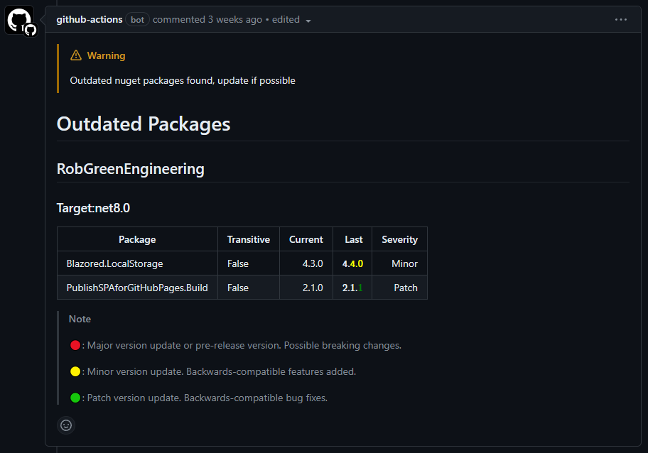
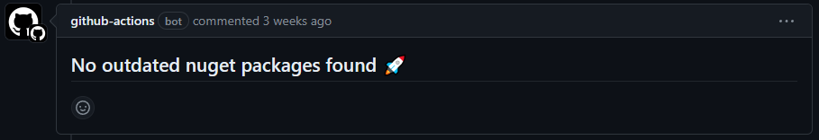
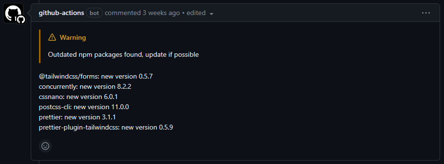
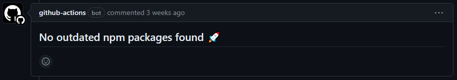

# outdated-packages-action
Github action for reporting on outdated dotnet packages in a solution or npm packages in a project directory.

## Overview

This action will run either or both of: 

- <a href="https://github.com/dotnet-outdated/dotnet-outdated">dotnet-outdated</a> against a supplied dotnet solution
- <a href="https://github.com/MeilCli/npm-update-check-action">npm-update-check-action</a> against a supplied npm project directory

> [!NOTE]
> The intention of this action is purely to notify of any outdated packages and _not_ to perform any kind of update action.
>  
> Reports for any outdated packages found are added as a comment to the pull request used to run this action.
> 
> If the action is re-run against a pull request that has already been commented on, the existing comment will be updated. 

> [!WARNING]
> This action is designed to be actioned only within the context of a pull request, no other scenarios are catered for.

## Inputs

#### `use-dotnet-outdated`

**Optional** - Whether to run dotnet-outdated. Default `false`.

#### `dotnet-solution-path`

**Optional** - The path to the dotnet solution file. Required if `use-dotnet-outdated` is `true`.

#### `use-npm-outdated`

**Optional** - Whether to run npm-update-check-action. Default `false`.

#### `npm-project-directory`

**Optional** - The path to the npm project directory. Default `.`.

## Example github action 

outdated.yml
```yaml
name: Outdated package checks

# Run workflow on pull request to the main branch
on:
  pull_request:
    types: [opened, synchronize, reopened]
    branches: [ main ]

env:
  SOLUTION_PATH: 'src/RobGreenEngineering.sln'
  PROJECT_DIR: 'src/RobGreenEngineering'

jobs:
  outdated-packages-check:
    runs-on: ubuntu-latest

    steps:
      - uses: trossr32/outdated-packages-action@v0.0.8
        with:
          # Whether to run dotnet-outdated. Default is false if not supplied.
          use-dotnet-outdated: true
          # The path to the dotnet solution file. Required if use-dotnet-outdated is true.
          dotnet-solution-path: ${{ env.SOLUTION_PATH }}
          # Whether to run npm-update-check-action. Default is false if not supplied.
          use-npm-outdated: true
          # The path to the npm project directory.
          # Default is '.', so only required if the npm project is not the root of the repository.
          npm-project-directory: ${{ env.PROJECT_DIR }}
```

## Example output

#### dotnet packages are outdated



#### dotnet packages up to date



#### npm packages are outdated



#### npm packages up to date



## Credit

This action leverages these projects:

- <a href="https://github.com/dotnet-outdated/dotnet-outdated">dotnet-outdated</a>
- <a href="https://github.com/MeilCli/npm-update-check-action">npm-update-check-action</a>
- <a href="https://github.com/thollander/actions-comment-pull-request">actions-comment-pull-request</a>

## Contribute
Please [create a pull request](https://github.com/trossr32/outdated-packages-action/compare) and get in touch. Alternatively feel free to [raise an issue](https://github.com/trossr32/outdated-packages-action/issues/new/choose) if you've found a bug or want to suggest a new feature.
